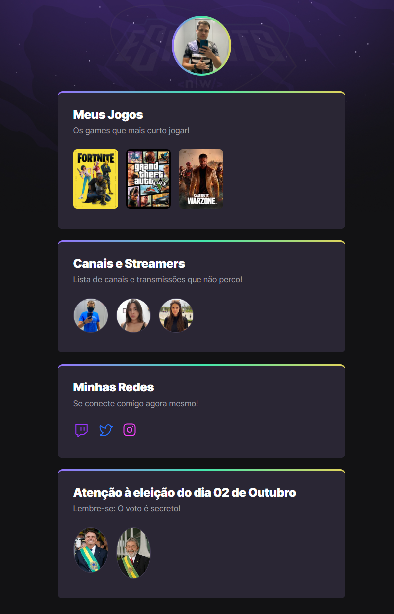

# NLW eSports - 

> Trilha explorer

Projeto construido no evento Next Level Week da Rocketseat.

[🔗Clique aqui para acessar](https://raphaelp-silva.github.io/nlw)

## 🛠  Tecnologias 

- HTML
- CSS
- Git e Github

## Pontos que desenvolvi com este projeto:

- Aprendi do zero como criar uma página com alguns links e imagens, assim como o aperfeiçoamento da página através do CSS e suas funcionalidades. 

## 💚 Contato

raphaelp.silva@outlook.com

